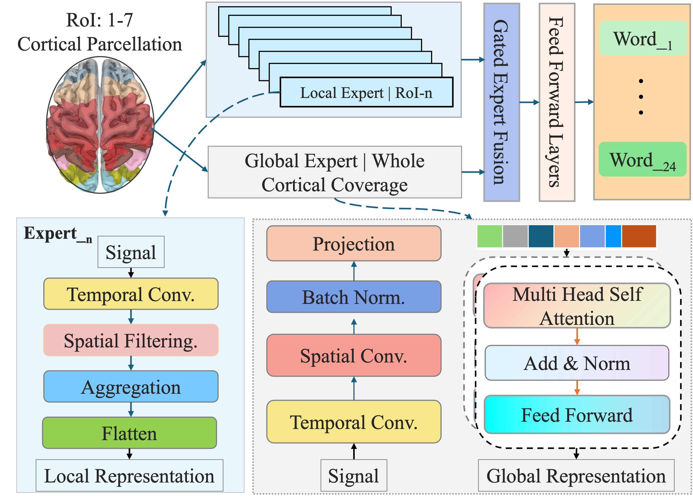

# BrainStack

> Neuro-MoE with Functionally Guided Expert Routing for EEG-Based Language Decoding 
> CVPR 2026 Findings (Accepted)

## 🔬 Overview

**BrainStack** is a functionally guided Neuro-MoE framework for EEG-based language decoding. Inspired by neuroscience, it partitions EEG signals by functional brain region and fuses local and global neural representations using adaptive expert routing.

This repository contains the code and instructions to reproduce the experiments in our CVPR 2026 paper.

<div align="center">
  
  <p><i>Fig: BrainStack architecture with global CTNet, local CNNs, and a Gated Meta-Learner.</i></p>
</div>

---

## 🚀 Highlights

- 🧩 **Heterogeneous Architecture**: Combines a global Transformer encoder (CTNet) with seven lightweight regional CNNs (CNet).
- 🎯 **Gated Expert Fusion**: Meta-learner adaptively fuses region-wise features with learnable attention weights.
- 🔁 **Cross-Regional Distillation**: The global expert provides top-down supervision to regional experts for semantic alignment.
- 📊 **New Dataset**: Introduces SS-EEG, one of the largest silent speech EEG datasets (120+ hours, 12 collected subjects, 24-word vocabulary).
- 📈 **SOTA Performance**: Achieves 41.87% avg. accuracy on a 24-word classification task, surpassing CNN/Transformer baselines and pretrained models.

---

## 📁 Project Structure

```
BrainStack/
├── data/                   # Data preprocessing and loading scripts
│   └── load_data.py       # Data loading utilities
├── trainer/                # Training and evaluation scripts
│   ├── construct_model.py # Model construction
│   ├── train.py           # Training loop
│   └── validate.py        # Validation utilities
├── assets/                 # Images and resources
│   ├── brainstack_architecture.png
│   ├── eeg_areas.py       # EEG region definitions
│   └── Info_128EEG_channel_idx_label.csv
├── docs/                   # Documentation and paper
├── main.py                 # Entry point for training and evaluation
├── model.py                # CTNet, CNet, and Gated Meta-Learner implementations
├── loss.py                 # Dynamic multi-objective loss and distillation
├── utils.py                # Miscellaneous utilities (metrics, schedulers)
├── options.py              # Command line argument parsing
└── requirements.txt        # Required Python packages
```

---

## 🧠 Dataset

We introduce **SilentSpeech-EEG (SS-EEG)**, a 120-hour EEG dataset for silent speech decoding across 12 subjects (10 subjects in the current public release).  

| Feature         | Value                 |
|----------------|-----------------------|
| Subjects        | 12 collected (10 public release) |
| Words           | 24 (6 semantic classes) |
| Trials / Subject | 6000                 |
| Duration        | 120+ hours total      |
| Channels        | 122 EEG + 11 extras   |
| Sampling Rate   | 1000 Hz               |


> 📌 *Due to ethics restrictions, the current public release includes 10 subjects. Access to the remaining anonymized recordings is available upon request, subject to approval.*

---

## 🚀 Getting Started

### 1. Clone the repository

```bash
git clone https://github.com/Jacoo-Zhao/BrainStack.git
cd BrainStack
```

### 2. Create a conda environment

```bash
conda create -n brainstack python=3.8
conda activate brainstack
pip install -r requirements.txt
```

### 3. Run training (example)

```bash
# Basic training with default settings
python main.py --note "experiment_1"

# Custom training with specific parameters
python main.py --model brainStack --subject S01 --split leave-one-session-out --lr 0.005 --batch 16 --epoch 100 --note "my_experiment"

# Cross-subject evaluation
python main.py --split cross-subject --note "cross_subject_test"
```

### 4. Available Arguments

| Argument | Default | Options | Description |
|----------|---------|---------|-------------|
| `--model` | `brainStack` | `brainStack` | Model architecture to use |
| `--subject` | `S01` | `S01`-`S10`, `all` | Subject for training |
| `--split` | `leave-one-session-out` | `cross-subject`, `leave-one-session-out` | Data split method |
| `--lr` | `0.005` | Float | Learning rate |
| `--batch` | `16` | Integer | Batch size |
| `--epoch` | `100` | Integer | Number of training epochs |
| `--dropout` | `0.25` | Float | Dropout rate |
| `--ds` | `1000` | Integer | EEG downsampling rate |
| `--note` | Required | String | Experiment identifier |

---

## 📈 Performance


| Model             | Params | Avg. Acc (%) |
|------------------|--------|---------------|
| EEGNet            | 8.5K   | 28.78         |
| TCNet             | 78K    | 29.50         |
| EEGConformer      | 0.75M  | 23.89         |
| BrainStack (Ours) | 1.06M  | **41.87**     |

Training logs are automatically saved to WandB, and model checkpoints are saved in the `checkpoints/` directory.

---

## 📜 Citation

If you find this work useful, please cite:

```bibtex
@article{zhao2026brainstack,
  title={BrainStack: Neuro-MoE with Functionally Guided Expert Routing for EEG-Based Language Decoding},
  author={Zhao, Ziyi and Zhou, Jinzhao and Jiang, Xiaowei and Cao, Beining and Ma, Wenhao and Shen, Yang and Li, Ren and Wang, Yu-Kai and Lin, Chin-teng},
  journal={arXiv preprint arXiv:2601.21148},
  year={2026}
}
```
---
## 📄 License

The code is released under the **MIT License**. See `LICENSE` for details.

---

## 📬 Contact

For any questions or collaborations, feel free to open an issue or contact the first author at `ziyi.zhao-2@student.uts.edu.au`.

---
